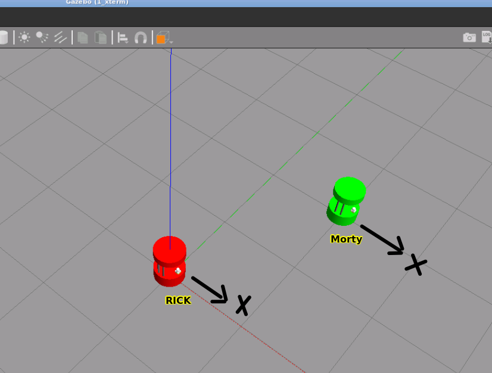
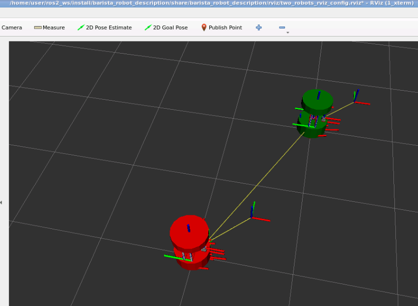
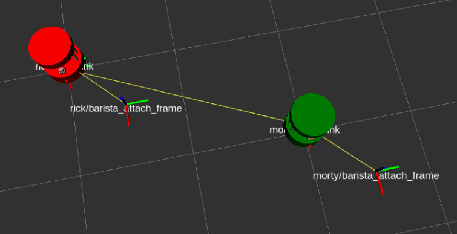

# ros2_theconstruct_checkpoint7, and 8


# Checkpoint 8

## Story and Project Goal 
Rick and Morty, the two cafeteria robots, are naturally playful beings. During quiet nights with no customers around, they often engage in games to entertain themselves. On this particular night, they came up with a unique game - "Catch Me If You Can." The rules of the game are straightforward: one robot must attempt to escape, while the other robot utilizes the TF frames to locate and track it. With the help of the TF tree, the pursuing robot can accurately identify the position of the escaping robot and give chase.

The objective of this project is to recreate the game of Rick and Morty in simulation. To achieve this, you will need to create a robot model using URDF and subsequently refactor it using XACRO macros. Additionally, you will need to implement an algorithm that enables a robot to pursue and follow another robot that is attempting to evade capture.

### Part1 Simulation of Multiple Robots 

- Create a launch file named barista_two_robots.launch.py that will start Gazebo and Rviz configured showing both robot models.
- There is no conflict with node names, topics and tf frames when spawning the same robot model two times in the same simulation enviroment.

Launch
```
ros2 launch barista_robot_description barista_two_robots.launch.py
```

My Result



